# Books and Films

Books and Films is a website designed for literature and movie enthusiasts who want to connect with a like-minded community, share their perspectives, and discover new works. It provides a centralized platform where users can immerse themselves in the world of books and movies through various features tailored to enhance their experience.

Users can write detailed reviews about their favorite books and films, highlighting what makes them unique or sharing constructive criticism. The platform encourages thoughtful discussion and allows for editing and deletion of reviews to keep content relevant and up-to-date.

By organizing content into categories and genres, Books and Films makes it easy for users to find what aligns with their preferences, whether they are fans of fantasy novels, thrillers, documentaries, or romance films. This targeted filtering ensures a more personalized browsing experience.

Interaction is a key aspect of the platform. Users can engage with the community by liking reviews, posting comments, and joining discussions. This social element fosters a sense of belonging and encourages users to explore different perspectives.

Why Users Would Choose Books and Films:
1. Discover New Content:
  Users looking for recommendations can browse reviews across diverse categories and genres, helping them find their next favorite book or movie.
2. Express Creativity:
  Aspiring critics can share their insights and develop their reviewing skills in a supportive environment.
3. Build Connections:
  The platform brings together literature and cinema enthusiasts, allowing them to connect, discuss, and form friendships based on shared interests.
4. Stay Organized:
  Users can create and manage their personal reviews, making it easier to track their thoughts on books and movies over time.
5. Empowered Decision-Making:
  Detailed reviews and ratings provide valuable insights, helping users make informed choices about what to read or watch next.
6. Customizable Exploration:
  With robust filters and genre-based navigation, users can tailor their experience, focusing on topics that matter most to them.
7. Contribute to a Growing Community:
  By sharing their thoughts, users actively participate in building a comprehensive and diverse library of reviews, benefitting the entire community.

Books and Films isn’t just a platform; it’s a hub for creativity, connection, and discovery, designed to elevate the experience of every literature and movie enthusiast. Whether you’re a casual fan or a dedicated critic, the site offers tools and opportunities to deepen your appreciation for the stories you love.

---

## Features

### Existing Features

#### **Navigation Bar**

- Fully responsive navigation bar present on all pages.
- Includes links to home, user profile, categories, and the login/register page.
- Provides seamless navigation across the website for all users.
- Consistent design to enhance user experience.

  

#### **Home Page**

- Displays all reviews sorted by creation date.
- Features category filters and thumbnails for each review.
- Engages users with dynamic and visually appealing content.

  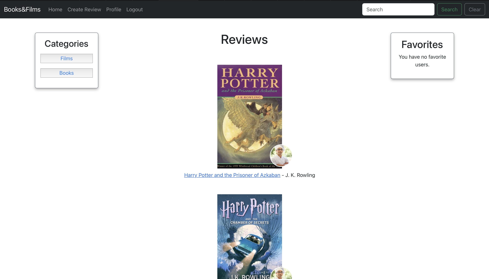

#### **Review Creation**

- Users can create a review with a title, author/director, content, genre, and optional image.
- Provides validation to ensure required fields are filled before submission.

  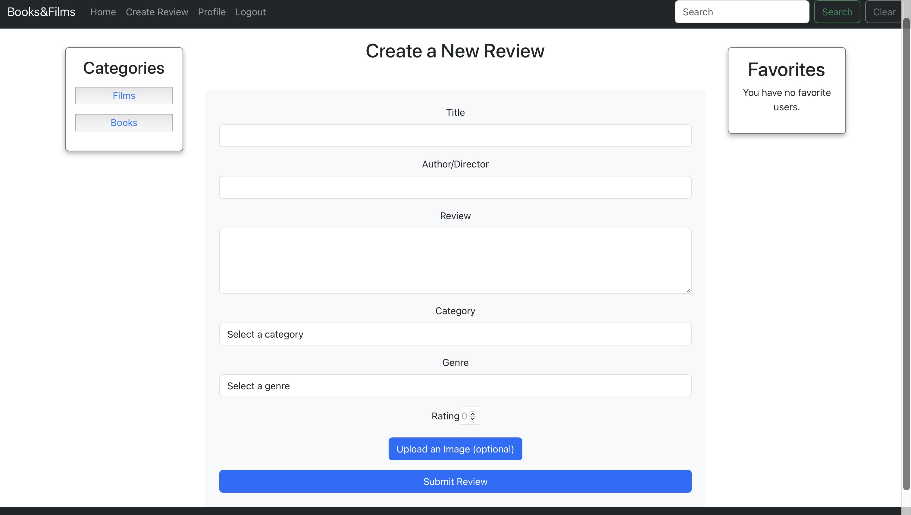

#### **Categories and Genres**

- Categories allow users to filter content based on their preferences.
- Dropdown menus for genres within each category make navigation intuitive.
- Each genre links to a filtered view displaying relevant reviews.

  

#### **Review Details**

- Displays the full content of a review, including the title, author/director, genre, rating, and associated image.
- Allows users to like reviews and post comments.
- Includes options to edit or delete reviews if they are the author.

  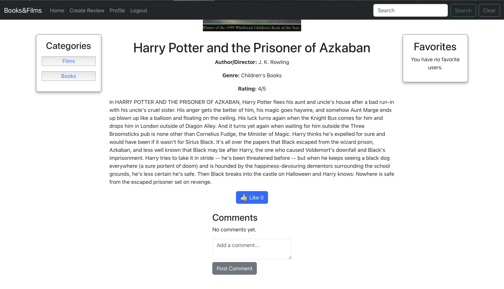

#### **User Profile**

- Users can view and update their profile, including personal details and profile picture.
- Displays all reviews created by the user with options to edit or delete.
- Provides access to change the user’s password.

  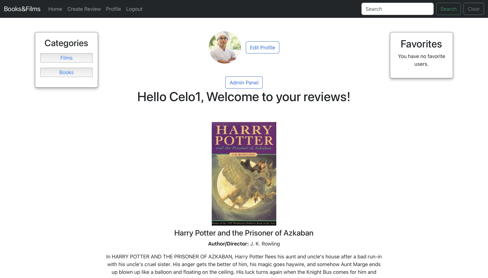
  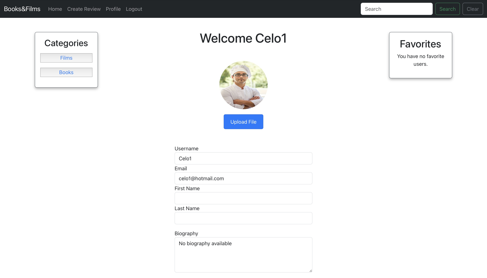

#### **Favorites**

- Users can mark profiles as favorites for quick access.
- Displays a grid of favorite profiles with links to their review lists.

  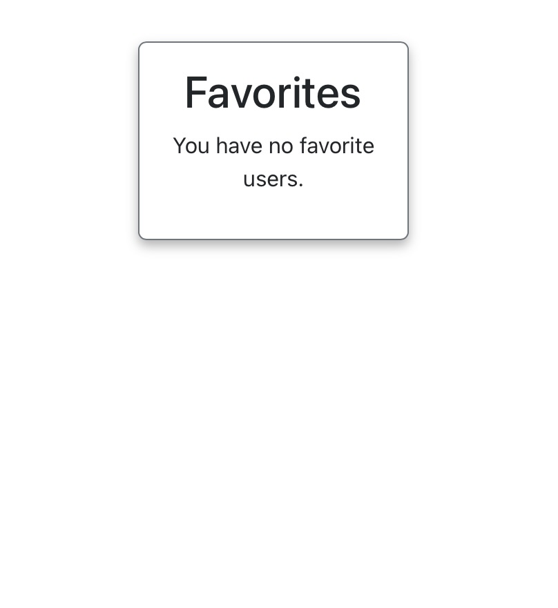

---

### Features Left to Implement

- User feedback survey form.
- Enhanced statistics for user reviews (e.g., most liked or commented).
- Integration of a recommendation engine based on user preferences.

---

## Testing

### Validator Testing

- **HTML Validation**  
  No major errors were found using the [W3C Validator](https://validator.w3.org).

  
  
  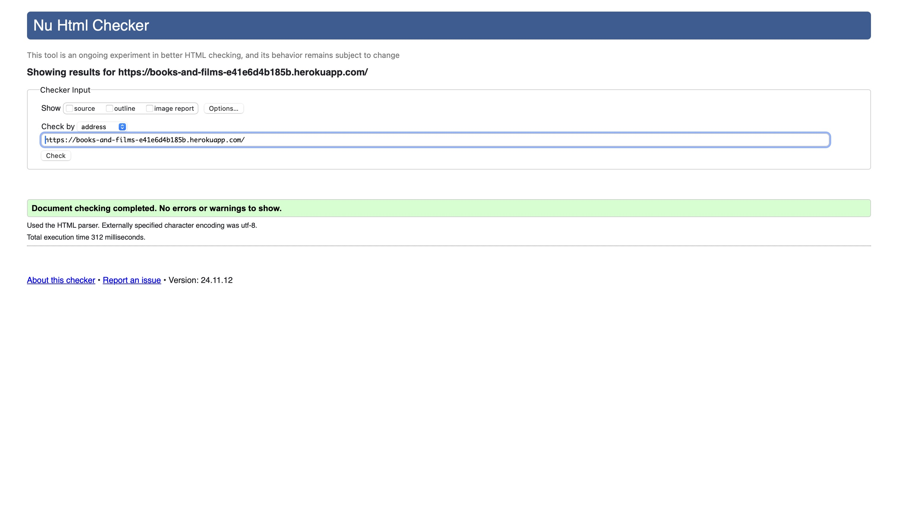
  
  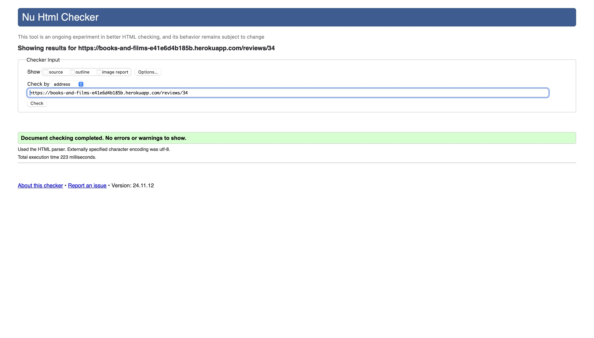
  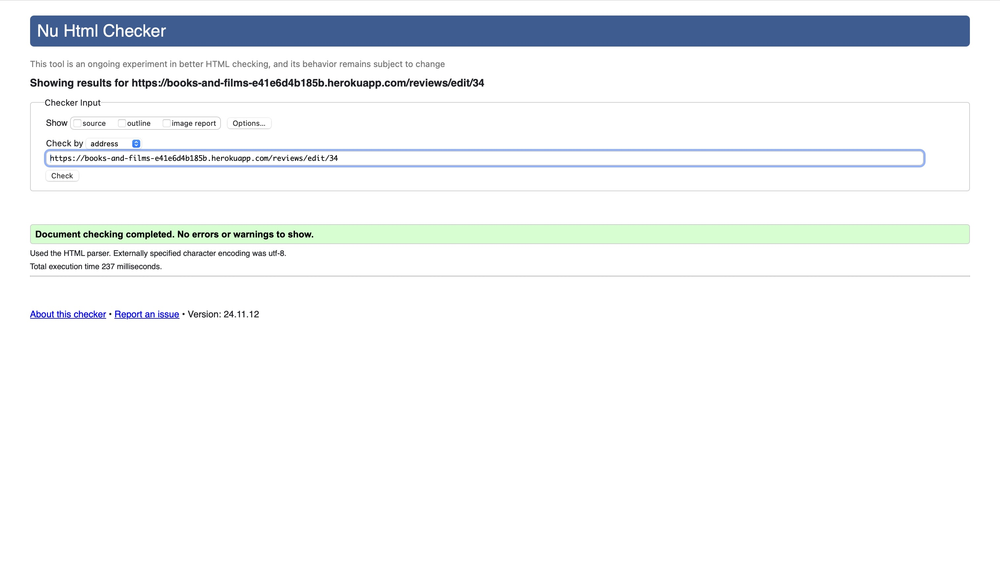
  
  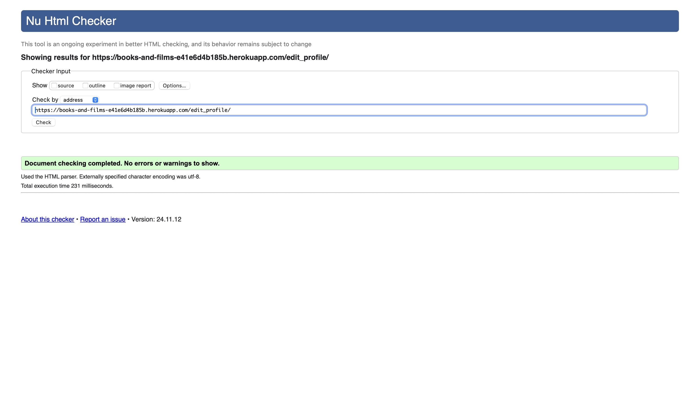

- **CSS Validation**  
  Passed the [Jigsaw CSS Validator](https://jigsaw.w3.org/css-validator/).

  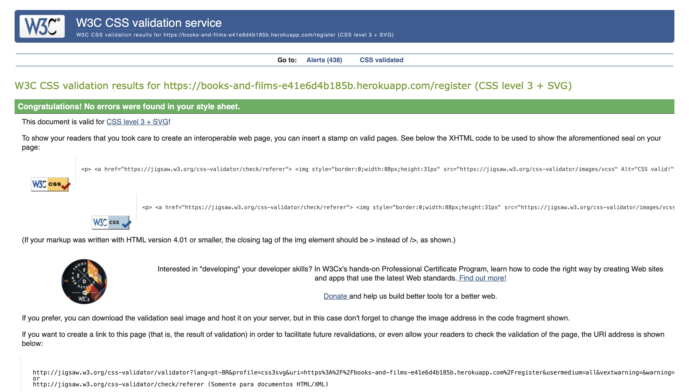
  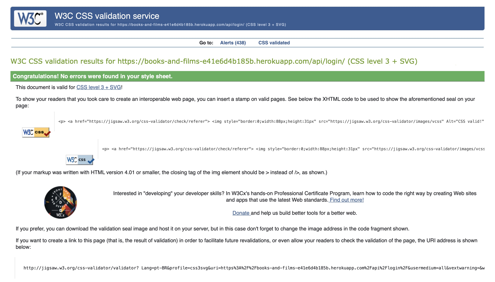
  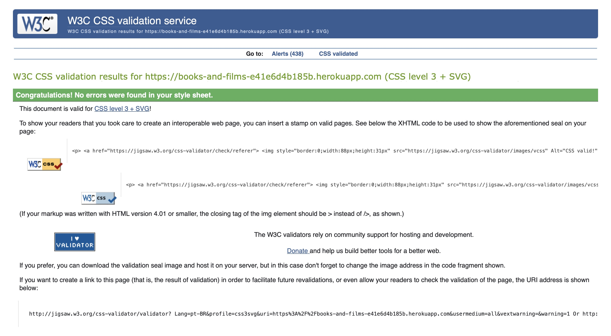
  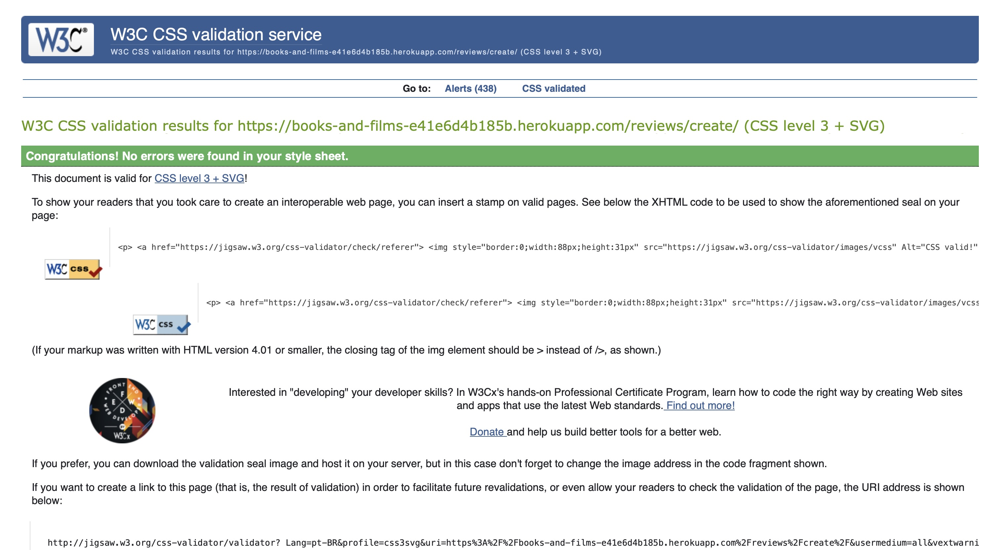
  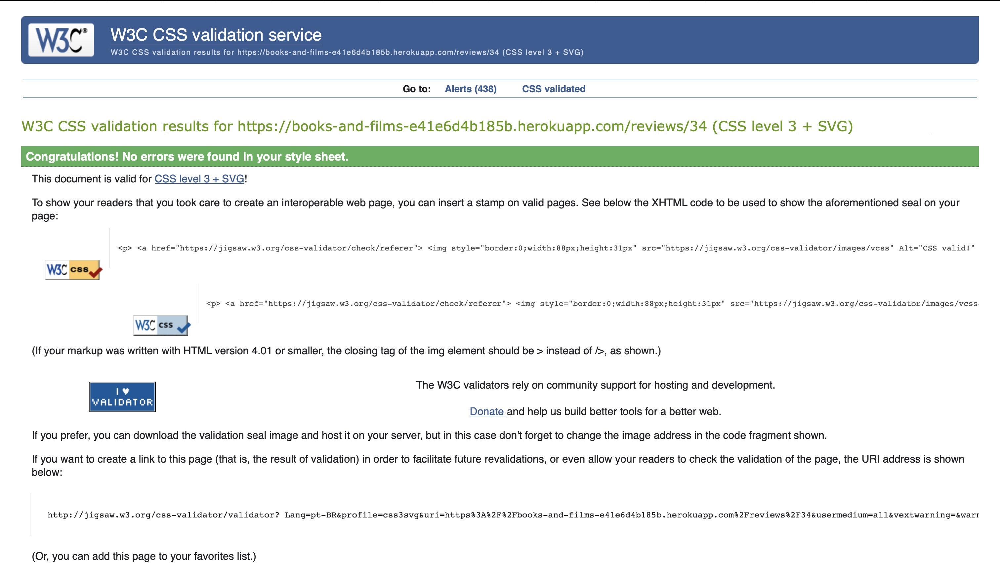
  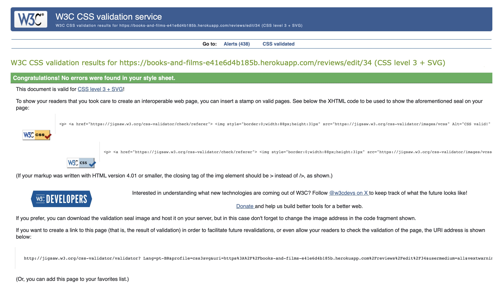
  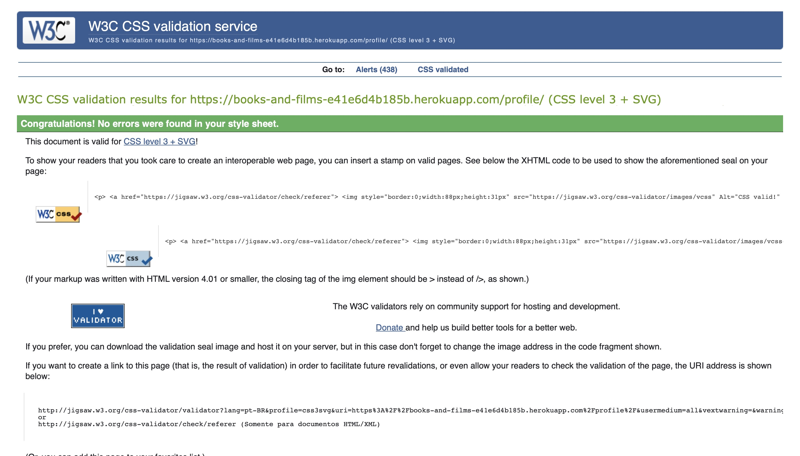
  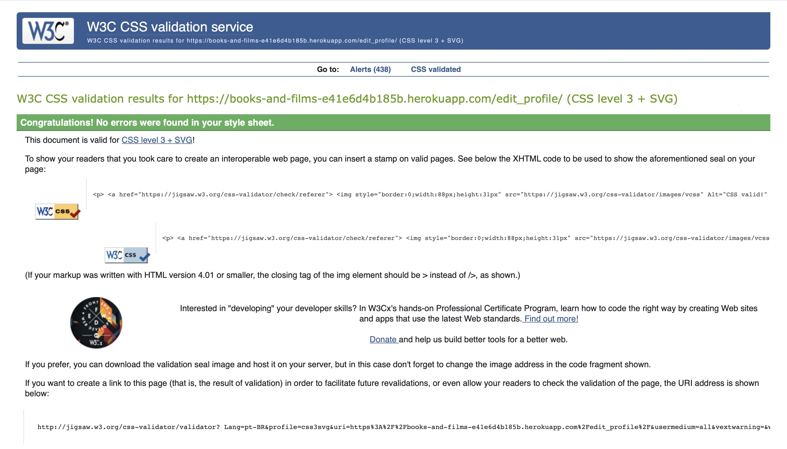
  
 

---

### Check List

| **Functionality**              | **Expected Behavior**                                | **Result** |
|--------------------------------|-----------------------------------------------------|------------|
| **Page Load**                  | Loads with correct layout and content.              | Pass       |
| **Responsive Design**          | Adjusts properly on different screen sizes.         | Pass       |
| **Login Functionality**        | Redirects and displays error/success messages.      | Pass       |
| **Logout Functionality**       | Logs the user out and redirects to login page.      | Pass       |
| **Category Links**             | Displays filtered reviews by category.              | Pass       |
| **Genre Links**                | Displays filtered reviews by genre.                 | Pass       |
| **Review Creation**            | Allows users to create new reviews with validation. | Pass       |
| **Edit Review**                | Allows users to update existing reviews.            | Pass       |
| **Delete Review**              | Deletes user-created reviews after confirmation.    | Pass       |
| **Comments**                   | Users can add, edit, and delete comments.           | Pass       |
| **Password Reset**             | Handles password reset requests and updates.        | Pass       |
| **Favorites**                  | Displays and navigates to favorite profiles.        | Pass       |

---

### Lighthouse Tests

- Lighthouse tests were conducted to ensure performance, accessibility, and responsiveness.

  

---

## Deployment

For correct operation, it is necessary to create two apps on Heroku, one for the frontend and one for the API.
The deployment process ensures that your Books and Films application is live and accessible to users. Below is a step-by-step guide with detailed explanations for deploying the application using Heroku:

1. **Clone the Repository**  
   Clone the project repositories to your local environment or GitHub account.

2. **Install Heroku CLI**  
   Download and install the Heroku CLI.
   After installation, log in using:

    `heroku login`, on your terminal.

   This opens a browser window for authentication.

3. **Create a Heroku App**  
   On your Heroku dashboard, click the `New` button in the right corner and then `Create new app`.
   On the next page, add a name for your app and select the region you want.
   On the next page, navigate to the `Deploy` section and in the `Deployment method` option select `Github`, connect to your Github repository.

   **Repeat this process to create the second app where the API will work**

4. **Add Necessary Add-ons**  
    **This step is only necessary for the API app**
    In the `Resources` tab on your Heroku app's dashboard, add the following `add ons` to the search field:

    - Heroku Postgres for the database.
    - Cloudinary for image storage.

5. **Configure Environment Variables**  

    **Frontend app**
    In the Heroku dasbord, go to the `settings` tab and in the `Config Var` section add the following variable: 
    - `REACT_APP_API_URL` with the value of the url of your Api app.

    It can be found in the dasbord of your API app in the `settings` tab in the `Domains` section.

    **API app**
    In the Heroku dasbord, go to the `settings` tab and in the `Config Var` section add the following variable:
    - `ALLOWED_HOSTS`: Your app's domain.
    - `DATABASE_URL`: URL for the Postgres database.
    - `CLOUDINARY_URL`: Your Cloudinary API key.
    - `EMAIL_HOST_USER`: Email for password recovery.
    - `EMAIL_HOST_PASSWORD`: App-specific password.
    - `DEBUG` : value of False.
    - `SECRET_KEY`: Django secret key.

6. **Perform Database Migrations**  
    On your environment access the Heroku terminal:

    `heroku run bash -a your api app name`
    Replace "your api app name" with the name of your API app

    Run `python manage.py migrate` in the Heroku terminal.

7. **Deploy the Application**  
   After this process, in the `Deploy` tab in the `Manual deploy` section, click on the `Deploy Branch` button to start the app.

8. **Access the Live Application**  
   The site will be live at the Heroku app URL.

---

## Content

- The textual content was sourced from:
  - [Common Sense Media](https://www.commonsensemedia.org)

- Images were sourced from:
  - [Common Sense Media](https://www.commonsensemedia.org)
  - [Pexels](https://pexels.com)

---

