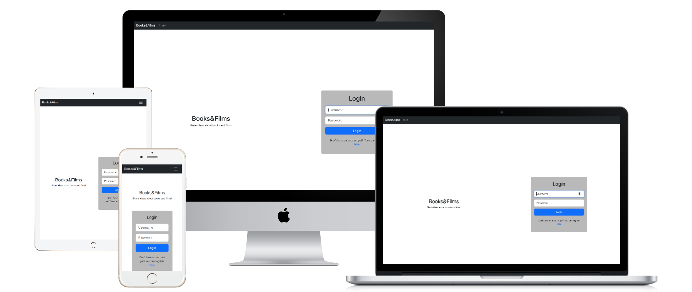
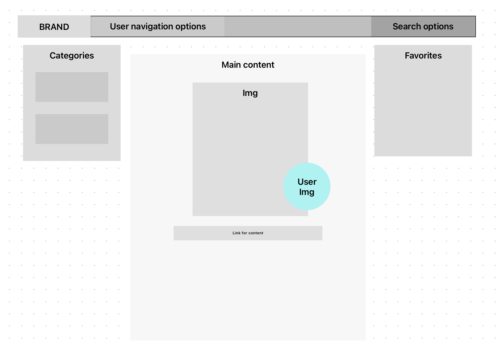
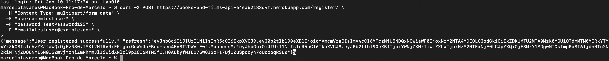
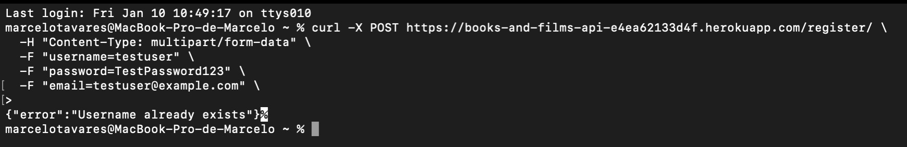
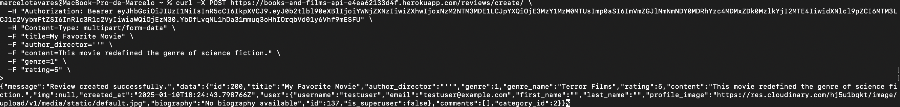
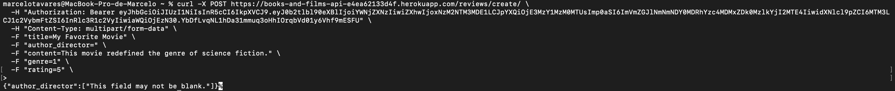
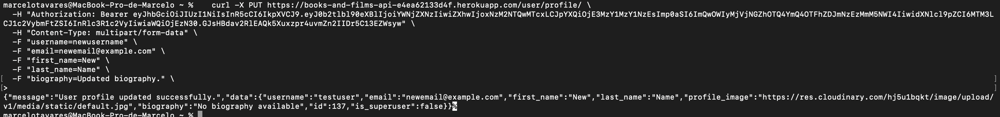
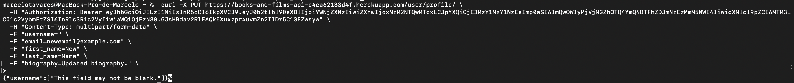
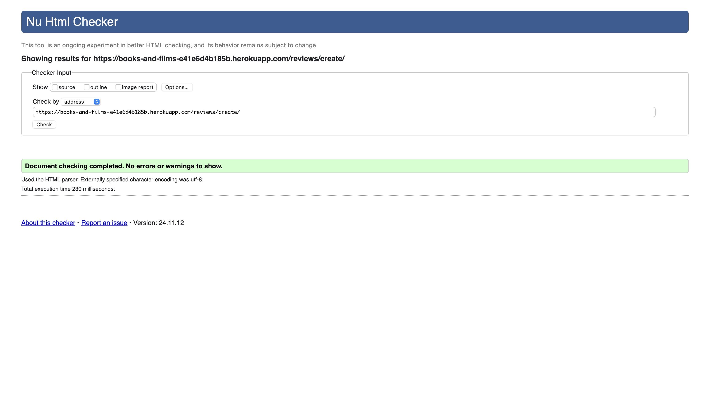
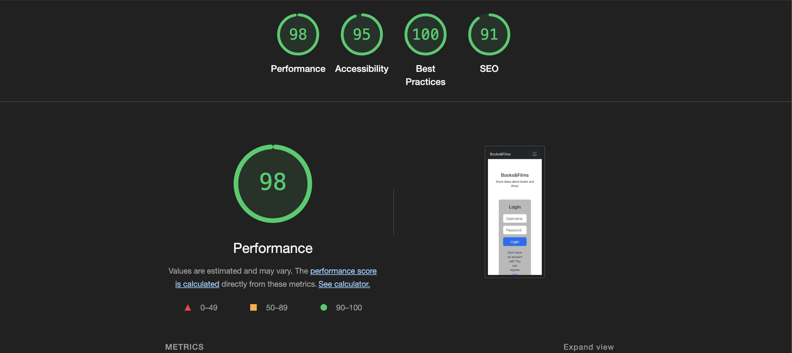

# Books and Films

Books and Films is a website designed for literature and movie enthusiasts who want to connect with a like-minded community, share their perspectives, and discover new works. It provides a centralized platform where users can immerse themselves in the world of books and movies through various features tailored to enhance their experience.

Users can write detailed reviews about their favorite books and films, highlighting what makes them unique or sharing constructive criticism. The platform encourages thoughtful discussion and allows for editing and deletion of reviews to keep content relevant and up-to-date.

By organizing content into categories and genres, Books and Films makes it easy for users to find what aligns with their preferences, whether they are fans of fantasy novels, thrillers, documentaries, or romance films. This targeted filtering ensures a more personalized browsing experience.

Interaction is a key aspect of the platform. Users can engage with the community by liking reviews, posting comments, and joining discussions. This social element fosters a sense of belonging and encourages users to explore different perspectives.

Why Users Would Choose Books and Films:
1. Discover New Content:
  Users looking for recommendations can browse reviews across diverse categories and genres, helping them find their next favorite book or movie.
2. Express Creativity:
  Aspiring critics can share their insights and develop their reviewing skills in a supportive environment.
3. Build Connections:
  The platform brings together literature and cinema enthusiasts, allowing them to connect, discuss, and form friendships based on shared interests.
4. Stay Organized:
  Users can create and manage their personal reviews, making it easier to track their thoughts on books and movies over time.
5. Empowered Decision-Making:
  Detailed reviews and ratings provide valuable insights, helping users make informed choices about what to read or watch next.
6. Customizable Exploration:
  With robust filters and genre-based navigation, users can tailor their experience, focusing on topics that matter most to them.
7. Contribute to a Growing Community:
  By sharing their thoughts, users actively participate in building a comprehensive and diverse library of reviews, benefitting the entire community.

Books and Films isn’t just a platform; it’s a hub for creativity, connection, and discovery, designed to elevate the experience of every literature and movie enthusiast. Whether you’re a casual fan or a dedicated critic, the site offers tools and opportunities to deepen your appreciation for the stories you love.




# Wireframe



This wireframe design showcases the layout of a user-friendly webpage with key functional areas and a visually balanced structure. Below is a detailed description of the sections:

## 1. Header Section
- **Brand**: Positioned on the top-left, this space is reserved for the company logo or website name.
- **User Navigation Options**: A centralized area providing navigation links for users to explore the website's features or categories.
- **Search Options**: Located on the top-right, this section is designed for users to input queries for searching content.

## 2. Left Sidebar
- **Categories**: A vertical area on the left-hand side for listing different content categories or sections for easy navigation.

## 3. Main Content Area
- **Image Placeholder (Img)**: A large rectangular space in the center, representing the primary visual content, such as a banner, image, or product display.
- **User Image**: A circular overlay near the bottom-right of the main image, potentially for user profile pictures or interactive elements.
- **Link for Content**: A button or link directly beneath the main image, serving as a call-to-action or additional navigational element.

## 4. Right Sidebar
- **Favorites**: A designated area for users to save or view their favorite content.

This wireframe is ideal for creating a visually appealing and functional webpage, ensuring ease of navigation while emphasizing key elements like the main content and user interactivity.

---

## Features

### Existing Features

#### **Navigation Bar**

- Fully responsive navigation bar present on all pages.
- Includes links to home, user profile, categories, and the login/register page.
- Provides seamless navigation across the website for all users.
- Consistent design to enhance user experience.

  

#### **Home Page**

- Displays all reviews sorted by creation date.
- Features category filters and thumbnails for each review.
- Engages users with dynamic and visually appealing content.

  

#### **Review Creation**

- Users can create a review with a title, author/director, content, genre, and optional image.
- Provides validation to ensure required fields are filled before submission.

  

#### **Categories and Genres**

- Categories allow users to filter content based on their preferences.
- Dropdown menus for genres within each category make navigation intuitive.
- Each genre links to a filtered view displaying relevant reviews.

  

#### **Review Details**

- Displays the full content of a review, including the title, author/director, genre, rating, and associated image.
- Allows users to like reviews and post comments.
- Includes options to edit or delete reviews if they are the author.

  

#### **User Profile**

- Users can view and update their profile, including personal details and profile picture.
- Displays all reviews created by the user with options to edit or delete.
- Provides access to change the user’s password.

  
  

#### **Favorites**

- Users can mark profiles as favorites for quick access.
- Displays a grid of favorite profiles with links to their review lists.

  

---

## Benefits of Using React

React is the cornerstone of the Books and Films platform, providing a robust, efficient, and user-friendly framework for building dynamic user interfaces. Here are some of the key benefits React offers to users:

### Enhanced Performance
React's virtual DOM ensures fast updates and rendering, providing a seamless and responsive user experience, even for data-intensive applications like Books and Films.

### Dynamic User Interface
With React's component-based architecture, the platform delivers a visually consistent and interactive design. Features like category filtering, dynamic review creation, and real-time updates feel natural and intuitive.

### Improved Interactivity
React's ability to manage state efficiently allows users to experience smooth interactions, such as liking reviews, posting comments, and editing profiles, without unnecessary page reloads.

### Responsive Design
React makes it easier to implement responsive designs that adapt seamlessly to different screen sizes and devices, ensuring a consistent experience for all users.

### Scalability
As Books and Films continues to grow, React's modular structure ensures that new features can be integrated with minimal disruption to the existing platform.

### Customizability
React's flexibility allows developers to create tailored components that enhance user engagement, such as personalized recommendations, interactive dashboards, and filtered content views.

### Community and Ecosystem
React's vast ecosystem of libraries and tools enhances development efficiency and ensures that the platform remains cutting-edge, benefitting users with faster updates and innovative features.

By leveraging React, Books and Films provides a responsive, scalable, and interactive platform that elevates the user experience, making it an ideal choice for enthusiasts of literature and cinema.

---

## Reusable Components in React

The Books and Films platform has been designed with modularity in mind, leveraging React's component-based architecture. This approach not only improves maintainability but also enables the reuse of components across different sections of the site. Below are some of the key reusable components:

### Navigation Bar
- **Description**: A fully responsive navigation bar that can be reused across all pages.
- **Features**:
  - Dynamic menu items based on user authentication status.
  - Consistent styling and responsiveness for both desktop and mobile views.
- **Use Cases**:
  - Included on the home page, user profile, and review details pages.

### Review Card
- **Description**: A component that displays a summary of a review, including the title, author/director, genre, and thumbnail image.
- **Features**:
  - Accepts props for review data, ensuring versatility for different contexts.
  - Includes functionality for liking reviews.
- **Use Cases**:
  - Displayed on the home page, category pages, and user profiles.

### Filter Dropdown
- **Description**: A dropdown component used for filtering content based on categories and genres.
- **Features**:
  - Dynamically renders options based on passed props.
  - Can handle events to update filtered results.
- **Use Cases**:
  - Found in category and genre filtering on the home page and other relevant views.

### Review Form
- **Description**: A form component for creating and editing reviews.
- **Features**:
  - Reusable validation logic for required fields.
  - Customizable input fields for title, content, genre, and image upload.
- **Use Cases**:
  - Used in the review creation and review editing functionalities.

### Comment Section
- **Description**: A component for displaying and managing comments on a review.
- **Features**:
  - Displays a list of comments with user details and timestamps.
  - Includes functionality for adding, editing, and deleting comments.
- **Use Cases**:
  - Embedded in the review details page.

### Profile Card
- **Description**: A compact display of user information, including their profile picture and name.
- **Features**:
  - Displays user-specific actions like viewing their reviews or favoriting their profile.
  - Designed for easy integration with grid layouts.
- **Use Cases**:
  - Displayed in the favorites section and user profile listings.

### Pagination Controls
- **Description**: A reusable pagination component for navigating through large datasets.
- **Features**:
  - Accepts props for the total number of pages, current page, and navigation handlers.
  - Consistent design for seamless integration.
- **Use Cases**:
  - Used in the home page, category pages, and user profiles to handle review listings.

### Modal
- **Description**: A versatile modal component for displaying content in a pop-up window.
- **Features**:
  - Configurable title, content, and action buttons.
  - Handles confirmation dialogs for sensitive actions like deleting reviews or comments.
- **Use Cases**:
  - Used in review deletion and confirmation dialogs across the platform.

### Notification Toast
- **Description**: A lightweight component for displaying temporary messages.
- **Features**:
  - Configurable message types (success, error, info).
  - Auto-dismiss functionality with customizable duration.
- **Use Cases**:
  - Displays feedback messages after actions like saving a review, liking a comment, or updating profile details.

### Image Upload Field
- **Description**: A reusable file input field for handling image uploads.
- **Features**:
  - Accepts props for default image preview and upload handlers.
  - Includes validation for supported file types and sizes.
- **Use Cases**:
  - Used in the profile creation, profile editing, and review creation forms.

By utilizing these reusable components, the Books and Films platform achieves a high level of consistency and efficiency. These components not only streamline development but also provide flexibility for future enhancements and feature additions.

---

### Features Left to Implement

- Password recovery through email service.
- Email validation.
- User feedback survey form.
- Enhanced statistics for user reviews (e.g., most liked or commented).
- Integration of a recommendation engine based on user preferences.

---

# API endpoints tests

This section describes the test for the **API endpoints**.
Tests for the endpoints were conducted, below are some examples of how to do the tests.

  ### How to Run the Test

  Use a tool like cURL, Postman, or similar to send the requests to the endpoint.
  Verify the response matches the expected status code and response body.

---

## Endpoint

`POST /register/`

 The endpoint allows a user to register by providing their `username`, `password`, and `email`. Optionally, a `profile_image` can be uploaded. The backend returns a success message and JWT tokens upon successful registration.

---

## Headers

 Content-Type: multipart/form-data

 ---

## Request Parameters

| Parameter      | Type       | Required | Description                         |
|----------------|------------|----------|-------------------------------------|
| `username`     | String     | Yes      | The username of the new user.       |
| `password`     | String     | Yes      | The password for the new account.   |
| `email`        | String     | Yes      | The user's email address.           |
| `profile_image`| File       | No       | An optional profile image file.     |

---

## Request Example (cURL)

 Access the terminal and paste the following example:

```bash
curl -X POST https://books-and-films-api-e4ea62133d4f.herokuapp.com/register/ \
  -H "Content-Type: multipart/form-data" \
  -F "username=testuser" \
  -F "password=TestPassword123" \
  -F "email=testuser@example.com" \
  ```

If successful, a message will be displayed:
   

If fail, a message will be displayed:
   

## Create Review API Test

This section describes how to test the **Create Review API** endpoint. This endpoint allows authenticated users to create a new review by providing details such as title, author/director, content, genre, rating, and an optional image file.

---

### **Endpoint**

`POST /reviews/create/`

---

### **Headers**

| Header          | Value                               | Required | Description                           |
|------------------|-------------------------------------|----------|---------------------------------------|
| `Authorization` | `Bearer <your-access-token>`        | Yes      | The JWT token obtained after login.   |
| `Content-Type`  | `multipart/form-data`               | Yes      | Specifies that the request contains file data. |

---

### **Request Parameters**

| Parameter         | Type       | Required | Description                              |
|-------------------|------------|----------|------------------------------------------|
| `title`           | String     | Yes      | The title of the review.                 |
| `author_director` | String     | Yes      | The author or director of the work.      |
| `content`         | String     | Yes      | The main content of the review.          |
| `genre`           | Integer    | Yes      | The ID of the genre for the review.      |
| `rating`          | Number     | Yes      | The rating for the work (0 to 5).        |
| `img`             | File       | No       | An optional image file related to the review. |

---

### **Request Example (cURL)**

```bash
curl -X POST https://books-and-films-api-e4ea62133d4f.herokuapp.com/reviews/create/ \
  -H "Authorization: Bearer <your-access-token>" \
  -H "Content-Type: multipart/form-data" \
  -F "title=My Favorite Movie" \
  -F "author_director=Christopher Nolan" \
  -F "content=This movie redefined the genre of science fiction." \
  -F "genre=1" \
  -F "rating=5" \
  -F "img=@/path/to/image.jpg"
 ```

 Replace <your-access-token> with a valid JWT access token and /path/to/image.jpg with the full path to an image file on your system.

  If successful, a message will be displayed:
   

  If fail, a message will be displayed:
   


# UserProfile API Tests

This section outlines how to test the **UserProfile** API endpoints for retrieving, updating. The endpoints require authentication with a valid JWT token.

---

 ### 1. **User Profile**

**Endpoint**: `PUT /user/profile/`
  Request Example (cURL):

  ```bash
  curl -X PUT https://books-and-films-api-e4ea62133d4f.herokuapp.com/user/profile/ \
  -H "Authorization: Bearer <your-access-token>" \
  -H "Content-Type: multipart/form-data" \
  -F "username=newusername" \
  -F "email=newemail@example.com" \
  -F "first_name=New" \
  -F "last_name=Name" \
  -F "biography=Updated biography." \
  -F "profile_image=@/path/to/new-image.jpg"
  ```

 Replace <your-access-token> with a valid JWT token.
 Replace /path/to/new-image.jpg with the path to a valid image file.

 If successful, a message will be displayed:
   

  If fail, a message will be displayed:
   


## Testing

### Validator Testing

- **HTML Validation**  
  No major errors were found using the [W3C Validator](https://validator.w3.org).

  
  
  
  
  
  
  
  

- **CSS Validation**  
  Passed the [Jigsaw CSS Validator](https://jigsaw.w3.org/css-validator/).

  
  
  
  
  
  
  
  
  
 


---

### Check List

| **Action**                        | **Expected Behavior**                                                                                     | **Result** |
|------------------------------------|-----------------------------------------------------------------------------------------------------------|------------|
|**Login page**|||
| **Page Load**                      | Renders login form with "Username" and "Password" fields, a "Login" button, and a registration link.      | Pass       |
| **Enter Username**                 | User inputs a valid username. Field updates with the entered text.                                        | Pass       |
| **Enter Password**                 | User inputs a valid password. Field updates with the entered text.                                        | Pass       |
| **Empty Submit**                   | Click "Login" with empty fields. Displays "Both fields are required." error message.                      | Pass       |
| **Invalid Username/Password**      | Submit with incorrect username or password. Displays server error message (e.g., "Invalid credentials"). | Pass       |
| **Successful Login**               | Submit with valid credentials. Stores `accessToken` and `userId` in `localStorage`, redirects to `/`.    | Pass       |
| **Form Validation**                | Prevents submission if fields are empty or invalid. Displays appropriate error messages.                  | Pass       |
| **Navigate to Register**           | Click "register" link. Redirects user to the registration page (`/register`).                            | Pass       |
| **Responsive Design**              | Properly adjusts layout on different screen sizes (mobile, tablet, desktop).                             | Pass       |
| **Password Visibility**            | Password input obscures entered text.                                                                    | Pass       |
| **Error Alert**                    | Displays error message in red alert box on login failure.                                                | Pass       |
|**Register page**|||
| **Page Load**                   | Renders registration form with "Username", "Password", "Email", and "Profile Image" fields, a "Register" button, and a login link. | Pass       |
| **Enter Username**              | User inputs a valid username. Field updates with the entered text.                                      | Pass       |
| **Enter Password**              | User inputs a valid password. Field updates with the entered text.                                      | Pass       |
| **Enter Email**                 | User inputs a valid email address. Field updates with the entered text.                                 | Pass       |
| **Upload Profile Image**        | User uploads an image file. File is accepted and stored in the state.                                   | Pass       |
| **Empty Submit**                | Click "Register" with empty fields. Displays "All fields are required." error message.                  | Pass       |
| **Short Password**              | Submit with a password shorter than 8 characters. Displays "Password must be at least 8 characters long." error message. | Pass       |
| **Invalid Email**               | Submit with an invalid email format. Displays "Please enter a valid email address." error message.       | Pass       |
| **Successful Registration**     | Submit with valid data. Sends API request, stores `token` in `localStorage`, and redirects to `/`.      | Pass       |
| **Form Validation**             | Prevents submission if fields are empty, invalid, or if password is too short. Displays error messages.  | Pass       |
| **API Error Handling**          | Displays server error message if registration fails (e.g., username already taken).                     | Pass       |
| **Navigate to Login**           | Click "Login" link. Redirects user to the login page (`/login`).                                        | Pass       |
| **Responsive Design**           | Properly adjusts layout on different screen sizes (mobile, tablet, desktop).                           | Pass       |
| **Error Alert**                 | Displays error message in red alert box on registration failure.                                        | Pass       |
|**Home page**|||
| **Page Load**                    | Checks token validity. If invalid, redirects to `/login`. If valid, fetches and displays reviews.         | Pass       |
| **Loading State**                | Displays "Loading..." message while data is being fetched.                                                | Pass       |
| **Token Validation**             | Validates token on page load. Redirects to `/login` if token is invalid or missing.                       | Pass       |
| **Fetch Reviews**                | Sends API request to fetch reviews using the provided token.                                              | Pass       |
| **Sort Reviews**                 | Sorts fetched reviews by creation date in descending order (newest first).                                | Pass       |
| **No Reviews Available**         | Displays "There is no review at the moment." if API returns an empty list.                                | Pass       |
| **API Error Handling**           | Displays "Failed to fetch reviews. Please login again." on API errors and redirects to `/login`.           | Pass       |
| **Display Review List**          | Displays reviews with title, author/director, and optional image.                                         | Pass       |
| **Link to Review Details**       | Each review title links to its detailed review page (e.g., `/reviews/:id`).                               | Pass       |
| **Display User Profile Image**   | Shows user's profile picture in the bottom-right corner of each review image, linking to their reviews.    | Pass       |
| **Navigate to User Profile**     | Clicking on a user's profile image redirects to their reviews page (`/user/:id/reviewsList`).             | Pass       |
| **Responsive Design**            | Adjusts layout and elements properly across different screen sizes (mobile, tablet, desktop).              | Pass       |
| **Error Message Display**        | Displays error messages in red text when applicable.                                                      | Pass       |
|**Review details page**|||
| **Page Load**                    | Validates token and fetches review details using the review ID from the URL. Redirects to `/login` if invalid. | Pass       |
| **Loading State**                | Displays "Loading..." message while data is being fetched.                                                  | Pass       |
| **Token Validation**             | Checks token validity on page load. Redirects to `/login` if token is invalid or missing.                   | Pass       |
| **Fetch Review Details**         | Sends API request to fetch review details using the provided review ID.                                     | Pass       |
| **Display Review Details**       | Displays review title, author/director, genre, rating, content, and optional image.                         | Pass       |
| **Like Review**                  | Sends API request to like the review and updates the like count dynamically.                                | Pass       |
| **Add Comment**                  | Submits a new comment using the API, updates the comment list, and clears the input field.                  | Pass       |
| **Edit Comment**                 | Allows the user to edit their own comment, updates it via the API, and displays the updated comment.        | Pass       |
| **Delete Comment**               | Prompts the user for confirmation and deletes the comment via the API if confirmed. Removes it from the list. | Pass       |
| **Handle No Comments**           | Displays "No comments yet." if the review has no comments.                                                  | Pass       |
| **Display Comments**             | Lists all comments associated with the review, including the username and content.                         | Pass       |
| **Navigate on Invalid Review**   | Displays "Review not found." if the review ID is invalid or review data is unavailable.                     | Pass       |
| **Error Handling**               | Displays "Failed to load review details." if the API request fails.                                         | Pass       |
| **Responsive Design**            | Properly adjusts layout on different screen sizes (mobile, tablet, desktop).                               | Pass       |
| **Confirmation Modal for Delete**| Displays a modal to confirm comment deletion.                                                               | Pass       |
|**Create reviews page**|||
| **Page Load**                    | Validates token. If invalid, redirects to `/login`. Fetches categories for the dropdown menu.             | Pass       |
| **Category Selection**           | Fetches and displays genres when a category is selected.                                                  | Pass       |
| **Enter Title**                  | Accepts and updates title input. Title must be between 3 and 100 characters.                              | Pass       |
| **Enter Author/Director**        | Accepts and updates author/director input. Value must be between 3 and 50 characters.                     | Pass       |
| **Enter Review Content**         | Accepts and updates review content. Value must be between 20 and 20000 characters.                        | Pass       |
| **Select Category**              | Allows user to select a category from the dropdown menu.                                                  | Pass       |
| **Select Genre**                 | Allows user to select a genre from the dropdown menu corresponding to the selected category.              | Pass       |
| **Enter Rating**                 | Accepts and updates rating input. Value must be between 0 and 5.                                          | Pass       |
| **Upload Image**                 | Accepts an image file and updates the selected file state. Displays the name of the uploaded file.        | Pass       |
| **Submit Valid Form**            | Sends form data via API. If successful, displays "Review created successfully!" and redirects to `/`.     | Pass       |
| **Validation: Empty Fields**     | Displays "Please fill in all required fields." if any required field is empty.                            | Pass       |
| **Validation: Invalid Title**    | Displays "The title must be between 3 and 100 characters." for invalid title length.                      | Pass       |
| **Validation: Invalid Author**   | Displays "The author/director name must be between 3 and 50 characters." for invalid length.              | Pass       |
| **Validation: Invalid Content**  | Displays "The review content must be between 20 and 20000 characters." for invalid content length.        | Pass       |
| **Handle API Error**             | Displays "An error occurred while creating the review." if the API request fails.                        | Pass       |
| **Success Message Display**      | Displays success message and clears form fields on successful review creation.                            | Pass       |
| **Responsive Design**            | Properly adjusts layout on different screen sizes (mobile, tablet, desktop).                             | Pass       |
|**Edit reviews page**|||
| **Page Load**                    | Validates token and fetches review details using the review ID. Redirects to `/login` if invalid.       | Pass       |
| **Display Review Details**       | Prefills the form with existing review data (title, content, genre, rating).                            | Pass       |
| **Edit Title**                   | Updates the title field in the form. Value must be between 3 and 100 characters.                        | Pass       |
| **Edit Content**                 | Updates the content field in the form. Value must be between 20 and 20000 characters.                   | Pass       |
| **Select Genre**                 | Updates the genre field based on user selection.                                                        | Pass       |
| **Edit Rating**                  | Updates the rating field. Value must be between 0 and 5.                                                | Pass       |
| **Upload Image**                 | Allows the user to select and upload a new image. Updates the image field in the form state.            | Pass       |
| **Save Edited Review**           | Sends updated review data via API. Displays "Review updated successfully!" on success and redirects to `/profile`. | Pass       |
| **Validation: Empty Fields**     | Displays "Please fill in all required fields." if any required field is empty.                          | Pass       |
| **Validation: Invalid Title**    | Displays "Title must be between 3 and 100 characters." if the title length is invalid.                  | Pass       |
| **Validation: Invalid Content**  | Displays "Content must be between 20 and 20000 characters." if the content length is invalid.           | Pass       |
| **Validation: Invalid Rating**   | Displays "Rating must be between 0 and 5." if the rating is out of bounds.                              | Pass       |
| **Handle API Error**             | Displays "An error occurred while saving the review." if the API request fails.                        | Pass       |
| **Cancel Edit**                  | Cancels the editing process and redirects to `/profile`.                                                | Pass       |
| **Responsive Design**            | Properly adjusts layout on different screen sizes (mobile, tablet, desktop).                           | Pass       |
|**Profile page**|||
| **Page Load**                    | Validates token. Redirects to `/login` if invalid. Fetches user profile and their reviews.              | Pass       |
| **Display User Profile**         | Displays the user's profile image, username, and a button to edit the profile.                         | Pass       |
| **Admin Panel Button**           | Displays a button to navigate to the Django admin panel if the user is a superuser.                    | Pass       |
| **Display Reviews**              | Displays a list of the user's reviews, including title, author/director, genre, rating, and content.    | Pass       |
| **Edit Review**                  | Clicking "Edit" navigates to the review editing page (`/reviews/edit/:id`).                            | Pass       |
| **Delete Review**                | Clicking "Delete" prompts for confirmation and removes the review upon confirmation.                   | Pass       |
| **Confirm Delete Modal**         | Displays a modal to confirm review deletion. Deletes the review if confirmed.                          | Pass       |
| **Handle Empty Reviews**         | Displays "No reviews found." if the user has no reviews.                                               | Pass       |
| **Error Handling**               | Displays error messages if there is an issue fetching data or deleting a review.                       | Pass       |
| **Success Message Display**      | Displays "Review deleted successfully!" after a successful deletion.                                   | Pass       |
| **Responsive Design**            | Properly adjusts layout on different screen sizes (mobile, tablet, desktop).                           | Pass       |
| **Loading State**                | Displays "Loading..." while user profile and reviews data are being fetched.                           | Pass       |
|**Edit Profile page**|||
| **Page Load**                    | Validates token. Redirects to `/login` if invalid. Fetches user profile data.                            | Pass       |
| **Display Profile Information**  | Displays username, email, name, biography, and profile picture.                                           | Pass       |
| **Edit Profile Information**     | Updates input fields for username, email, name, and biography.                                            | Pass       |
| **Profile Image Preview**        | Displays a preview of the selected profile image.                                                        | Pass       |
| **Save Profile Changes**         | Sends updated profile data via API. Displays "Profile updated successfully!" on success.                 | Pass       |
| **Validation: Invalid Email**    | Displays "Please provide a valid email address." if email is invalid.                                    | Pass       |
| **Change Password**              | Updates password fields. Validates new password and confirms it matches the confirmation field.          | Pass       |
| **Save New Password**            | Sends password update data via API. Displays "Password changed successfully!" on success.                | Pass       |
| **Validation: Password Length**  | Displays "New password must be at least 8 characters long." if the new password is too short.            | Pass       |
| **Validation: Password Mismatch**| Displays "New passwords do not match." if confirmation doesn't match the new password.                   | Pass       |
| **Delete Profile**               | Deletes user profile via API after confirmation. Redirects to `/login` on success.                       | Pass       |
| **Delete Confirmation Modal**    | Displays a modal to confirm profile deletion. Cancels deletion if user opts out.                         | Pass       |
| **Error Handling**               | Displays appropriate error messages for issues during profile update, password change, or deletion.      | Pass       |
| **Loading State**                | Displays "Loading..." while fetching profile data.                                                       | Pass       |
| **Responsive Design**            | Properly adjusts layout and forms on different screen sizes (mobile, tablet, desktop).                   | Pass       |
|**Favorites**|||
| **Page Load**                    | Validates token. Redirects to `/login` if invalid. Fetches the user's favorite profiles.               | Pass       |
| **Display Loading State**        | Displays "Loading favorites..." while fetching favorite profiles data.                                 | Pass       |
| **Display Error State**          | Displays "Failed to load favorites." if there is an error during data fetching.                        | Pass       |
| **Display Favorites**            | Displays a grid of favorite profiles with clickable profile images that link to their review pages.    | Pass       |
| **Handle No Favorites**          | Displays "You have no favorite users." if the user has no favorites.                                   | Pass       |
| **Favorite Profile Click**       | Navigates to the selected favorite user's review page (`/user/:id/reviewsList`).                       | Pass       |
| **Responsive Design**            | Adjusts layout and grid properly across different screen sizes (mobile, tablet, desktop).              | Pass       |
| **Error Handling**               | Handles authentication issues or API errors gracefully, displaying appropriate messages.               | Pass       |
| **Grid Layout**                  | Renders favorite profiles in a visually appealing grid format with consistent styling.                 | Pass       |
|**Filtered Reviews**|||
| **Page Load**                    | Validates token. Redirects to `/login` if invalid. Fetches reviews filtered by category or genre.       | Pass       |
| **Display Loading State**        | Displays "Loading..." while filtered reviews are being fetched.                                         | Pass       |
| **Display Error State**          | Displays "Failed to load reviews." if there is an error during data fetching.                          | Pass       |
| **Display No Reviews Message**   | Displays "No reviews found for the selected category or genre." if no reviews are returned.            | Pass       |
| **Display Filtered Reviews**     | Renders a list of reviews filtered by category or genre, including images, titles, and author/director. | Pass       |
| **Review Details Navigation**    | Clicking on a review title navigates to its detailed page (`/reviews/:id`).                            | Pass       |
| **User Profile Navigation**      | Clicking on a user's profile picture navigates to their review list (`/user/:id/reviewsList`).         | Pass       |
| **Responsive Design**            | Adjusts layout and elements properly across different screen sizes (mobile, tablet, desktop).          | Pass       |
| **Error Handling**               | Handles authentication issues or API errors gracefully, displaying appropriate messages.               | Pass       |
| **Dynamic API Query**            | Constructs the API endpoint dynamically based on category or genre parameter.                          | Pass       |
|**Search Results**|||
| **Display No Results Message**   | Displays "No results found." if the `results` array is empty.                                           | Pass       |
| **Display Search Results**       | Displays a list of results, including images, titles, and author/director information.                  | Pass       |
| **Review Details Navigation**    | Clicking on a review title navigates to its detailed page (`/reviews/:id`).                            | Pass       |
| **User Profile Navigation**      | Clicking on a user's profile picture navigates to their review list (`/user/:id/reviewsList`).         | Pass       |
| **Responsive Design**            | Properly adjusts layout and elements across different screen sizes (mobile, tablet, desktop).          | Pass       |
| **Error Handling**               | Gracefully handles an empty `results` array without causing crashes or rendering issues.               | Pass       |
| **Image Display**                | Shows the review image if available, with proper styling and alignment.                                | Pass       |
| **Profile Picture Display**      | Shows the user's profile picture with proper styling and alignment if available.                       | Pass       |
| **Dynamic Content Rendering**    | Dynamically renders results based on the content of the `results` array.                               | Pass       |
|**User Reviews page**|||
| **Page Load**                    | Validates token. Redirects to `/login` if invalid. Fetches user data, their reviews, and favorite status. | Pass       |
| **Display Loading State**        | Displays "Loading..." while user data and reviews are being fetched.                                   | Pass       |
| **Display Error State**          | Displays "Failed to load data." if there is an error during data fetching.                             | Pass       |
| **Display User Profile**         | Displays the user's profile image, username, and biography.                                            | Pass       |
| **Display Reviews**              | Displays a list of the user's reviews, including title, author/director, genre, and rating.            | Pass       |
| **Handle No Reviews**            | Displays "No reviews found." if the user has no reviews.                                               | Pass       |
| **Favorite User**                | Clicking "Favorite" adds the user to the favorites list via API and updates the button text.           | Pass       |
| **Unfavorite User**              | Clicking "Not Favorite" removes the user from the favorites list after confirmation.                   | Pass       |
| **Confirmation Modal for Remove**| Displays a modal to confirm removal of the user from the favorites list.                               | Pass       |
| **Responsive Design**            | Properly adjusts layout and elements across different screen sizes (mobile, tablet, desktop).          | Pass       |
| **Error Handling**               | Handles authentication and API errors gracefully, displaying appropriate messages.                     | Pass       |
| **Dynamic Content Rendering**    | Dynamically renders user reviews and updates favorite status based on API responses.                   | Pass       |


---

### Lighthouse Tests

- Lighthouse tests were conducted to ensure performance, accessibility, and responsiveness.

  

---

## Issues: Determining a Default Image for User Profiles

### **Problem:**
Initially, we attempted to assign a default profile image for users who did not upload their own image. This approach presented several challenges:
1. **Static Default Image:** Using a static URL for the default image introduced maintenance issues.

---

### **Solution:**
To address these challenges, we added an image upload field directly to the registration form. This allows users to choose their profile image during account creation, resolving the issues as follows:
- **User Choice:** The addition of an image input field (`<input type="file">`) empowers users to upload their profile image during registration, enhancing the customization experience.


## Deployment

For correct operation, it is necessary to create two apps on Heroku, one for the frontend and one for the API.
The deployment process ensures that your Books and Films application is live and accessible to users. Below is a step-by-step guide with detailed explanations for deploying the application using Heroku:

1. **Clone the Repository**  
   Clone the project repositories to your local environment or GitHub account.

2. **Install Heroku CLI**  
   Download and install the Heroku CLI.
   After installation, log in using:

    `heroku login`, on your terminal.

   This opens a browser window for authentication.

3. **Create a Heroku App**  
   On your Heroku dashboard, click the `New` button in the right corner and then `Create new app`.
   On the next page, add a name for your app and select the region you want.
   On the next page, navigate to the `Deploy` section and in the `Deployment method` option select `Github`, connect to your Github repository.

   **Repeat this process to create the second app where the API will work**

4. **Add Necessary Add-ons**  
    **This step is only necessary for the API app**
    In the `Resources` tab on your Heroku app's dashboard, add the following `add ons` to the search field:

    - Heroku Postgres for the database.
    - Cloudinary for image storage.

5. **Configure Environment Variables**  

    **Frontend app**
    In the Heroku dasbord, go to the `settings` tab and in the `Config Var` section add the following variable: 
    - `REACT_APP_API_URL` with the value of the url of your Api app.

    It can be found in the dasbord of your API app in the `settings` tab in the `Domains` section.

    **API app**
    In the Heroku dasbord, go to the `settings` tab and in the `Config Var` section add the following variable:
    - `ALLOWED_HOSTS`: Your app's domain.
    - `DATABASE_URL`: URL for the Postgres database.
    - `CLOUDINARY_URL`: Your Cloudinary API key.
    - `DEBUG` : value of False.
    - `SECRET_KEY`: Django secret key.

6. **Perform Database Migrations**  
    On your environment access the Heroku terminal:

    `heroku run bash -a your api app name`
    Replace "your api app name" with the name of your API app

    Run `python manage.py migrate` in the Heroku terminal.

7. **Deploy the Application**  
   After this process, in the `Deploy` tab in the `Manual deploy` section, click on the `Deploy Branch` button to start the app.

8. **Access the Live Application**  
   The site will be live at the Heroku app URL.

---

## Content

- The textual content was sourced from:
  - [Common Sense Media](https://www.commonsensemedia.org)
  - [Rotten Tomatoes](https://www.rottentomatoes.com)

- Images were sourced from:
  - [Common Sense Media](https://www.commonsensemedia.org)
  - [Pexels](https://pexels.com)


